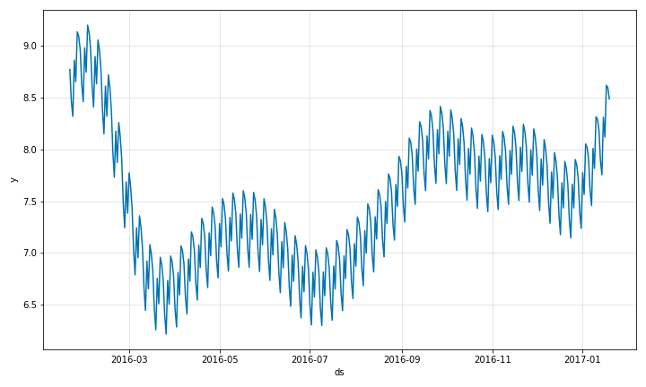
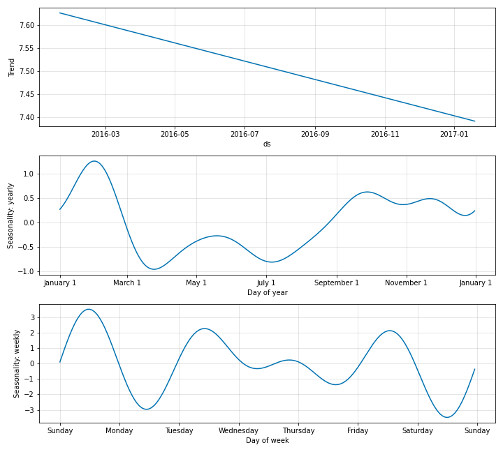
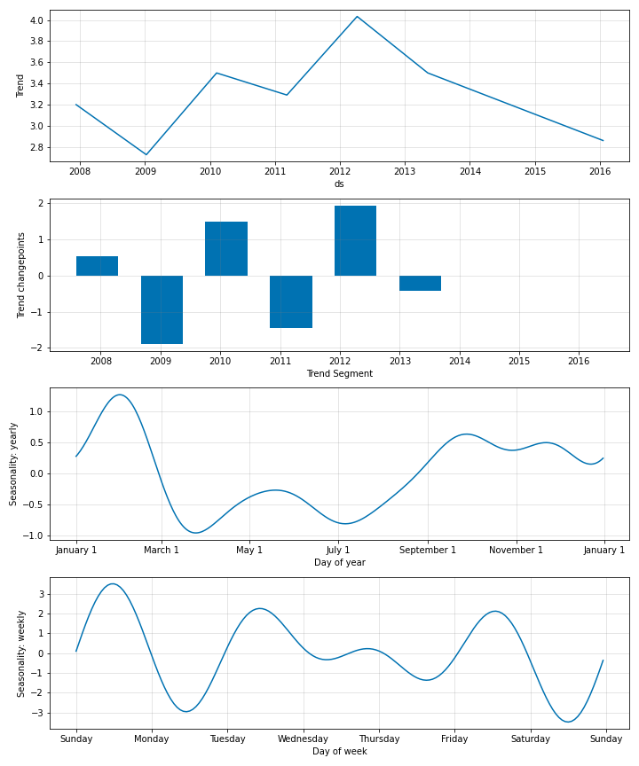

The documentation is a work in progress.

# Quick Start Guide
This page contains details of how you can build a simple model using NeuralProphet with 
minimal features.

## Install
After downloading the code repository (via `git clone`), change to the repository directory (`cd neural_prophet`) and install neuralprophet as python package with
`pip install .`

Note: If you plan to use the package in a Jupyter notebook, it is recommended to install the 'live' package version with `pip install .[live]`.
This will allow you to enable `plot_live_loss` in the `train` function to get a live plot of train (and validation) loss.

### Import
Now you can use NeuralProphet in your code:
```python
from neuralprophet import NeuralProphet
```

 
## Input Data

The input data format expected by the `neural_prophet` package is the same as in original 
`prophet`. It should have two columns, `ds` which has the timestamps and `y` column which
contains the observed values of the time series. Throughout this documentation, we 
will be using the time series data of the log daily page views for the [Peyton Manning](https://en.wikipedia.org/wiki/Peyton_Manning)
Wikipedia page. The data can be imported as follows.

```python
import pandas as pd
df = pd.read_csv('../example_data/example_wp_log_peyton_manning.csv')
```

The format of the data looks like below.

ds | y | 
------------ | ------------- |
2007-12-10|9.59|
2007-12-11|8.52|
2007-12-12|8.18|
2007-12-13|8.07|
2007-12-14|7.89|


## Simple Model

A simple model with `neural_prophet` for this dataset can be fitted by creating
an object of the `NeuralProphet` class as follows and calling the fit function. This 
fits a model with the default settings in the model.

```python
m = NeuralProphet()
metrics = m.fit(df, freq="D")
```

Once the model is fitted, we can make forecasts using the fitted model. For this, we first
need to create a future dataframe consisting of the time steps into the future that we need
to forecast for. `NeuralProphet` provides the helper function `make_future_dataframe` for
this purpose. Note that the the frequency of data is set globally here. 
Valid timeseries frequency settings are [pandas timeseries offset aliases](https://pandas.pydata.org/pandas-docs/stable/user_guide/timeseries.html#timeseries-offset-aliases).

```python
future = m.make_future_dataframe(df, periods=365)
forecast = m.predict(future)
```

## Plotting
With the forecasts obtained from the model, you can visualize them.
```python
forecasts_plot = m.plot(forecast)
```

{: style="height:350px"}

This is a simple model with a trend and a weekly seasonality and a yearly seasonality. You can also look at the individual components
separately. 

```python
fig_comp = m.plot_components()
```

{: style="height:500px"}

The individual coefficient values can also be plotted as below to gain further insights.

```python
fig_param = m.plot_components()
```

{: style="height:600px"}

## Validation
Model validation for NeuralProphet can be done in two ways. Users can split the dataset manually to
validate after the model fitting like below by specifying the fraction of data to be used for validation
in the argument `valida_p`. This validation set is reserved from the end of the series.

```python
m = NeuralProphet()
df_train, df_val = m.split_df(df, valid_p=0.2)
train_metrics = m.fit(df_train)
val_metrics = m.test(df_val)
```
You can now look at the training and validation metrics separately. You can also perform validation 
per every epoch during model fitting. This is done as follows by setting the `validate_each_epoch` argument
in the `fit` function call.

```python
# or evaluate while training
m = NeuralProphet()
metrics = m.fit(df, validate_each_epoch=True, valid_p=0.2)
```

<!-- highlight nth step -->
<!-- plot_last_forecast -->
<!-- hyperparameter tuning -->
